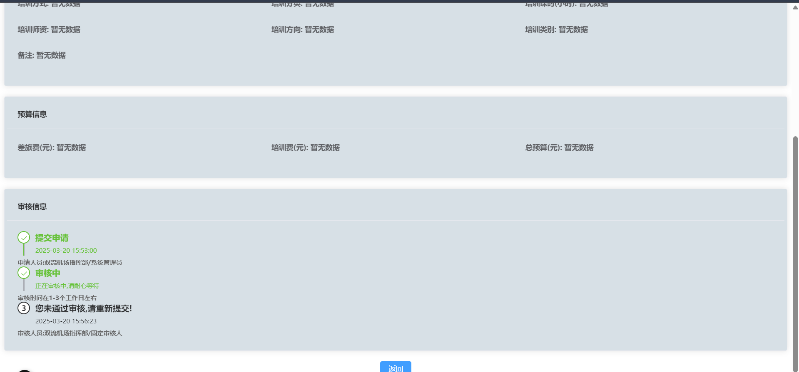
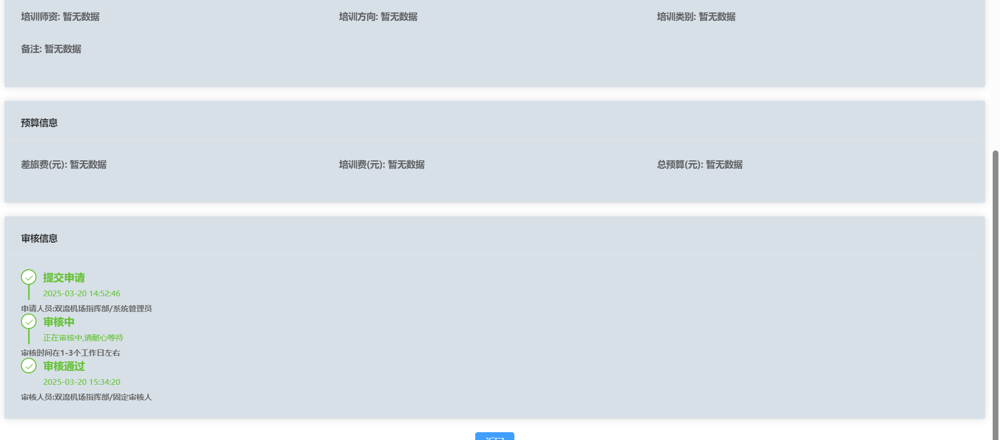
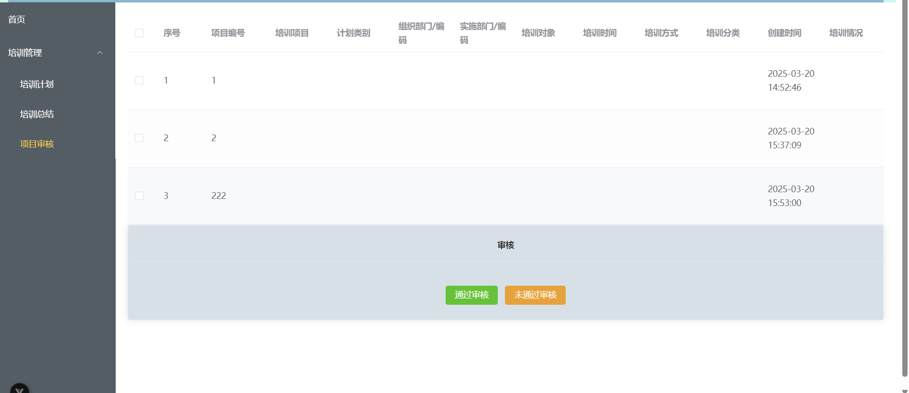
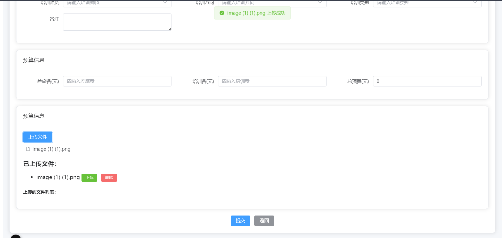
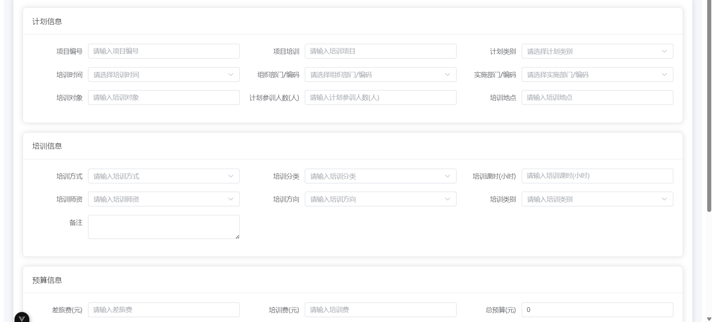

# **项目介绍 | Project Introduction**

基于本地浏览器的 Vue 小项目（清除浏览器数据时会删除数据）。  
A small Vue project based on local browser storage (data will be deleted when browser data is cleared).

---

# **当前版本 | Current Version**

1.16 审核系统进一步完善,优化代码逻辑

---

# **目前尚未实现的功能 | Unimplemented Features**

- 未实现登录验证功能（没有与后端绑定，可以使用 `api` 内的文件连接后端，需要修改 `plan.vue` 对应的代码）。  
  Login verification is not implemented (not bound to a backend, but you can use the files in the `api` folder to
  connect to a backend by modifying the corresponding code in `plan.vue`).

- 未实现表单验证功能（目前仅实现了主键不能重复）。  
  Form validation is not fully implemented (currently, only the primary key duplication check is implemented).

# **新增功能 | Unimplemented Features**

- 新增审核功能(完善)
  可以在查看页面查看审核进度 可以在审核页面对数据进行审核

---

# **Bug**

- 暂未发现

---

# **修复的 Bug | Fixed Bugs**

- 总预算没能传入数组，导致在查看数据时无法显示 [已修复]。
- 修复搜索问题,现在搜索不会影响数据了

---

# **美化界面 | UI Improvements**

- 做了点小美化。

---

# **项目截图 | Project Screenshots**

  
  

---

# **贡献指南 | Contribution Guidelines**

欢迎贡献代码！如果你有任何建议或发现 Bug，请提交 Issue 或 Pull Request。  
Contributions are welcome! If you have any suggestions or find a bug, please submit an Issue or Pull Request.

---

# **虽然是个未完善的小项目，但是喜欢的话请点亮 Star 吧！**

**Although this is an unfinished small project, if you like it, please give it a Star!**

---