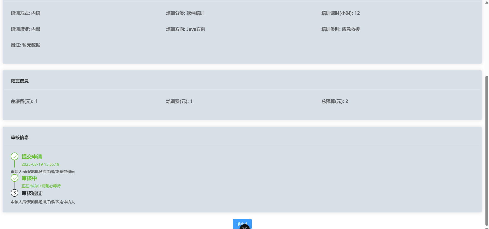

# **项目介绍 | Project Introduction**

基于本地浏览器的 Vue 小项目（清除浏览器数据时会删除数据）。  
A small Vue project based on local browser storage (data will be deleted when browser data is cleared).

---

# **目前尚未实现的功能 | Unimplemented Features**

- 未实现登录验证功能（没有与后端绑定，可以使用 `api` 内的文件连接后端，需要修改 `plan.vue` 对应的代码）。  
  Login verification is not implemented (not bound to a backend, but you can use the files in the `api` folder to
  connect to a backend by modifying the corresponding code in `plan.vue`).

- 未实现表单验证功能（目前仅实现了主键不能重复）。  
  Form validation is not fully implemented (currently, only the primary key duplication check is implemented).

---

# **当前版本 | Current Version**

1.1.3

---

# **Bug**

- 搜索后删除会导致所有数据删除，因为搜索逻辑没写好，暂时未修改。  
  Deleting after searching will cause all data to be deleted due to poorly implemented search logic. This has not been
  fixed yet.

---

# **修复的 Bug | Fixed Bugs**

- 总预算没能传入数组，导致在查看数据时无法显示 [已修复]。  
  The total budget was not passed into the array, causing it to be unavailable when viewing data [Fixed].

---

# **文件上传与下载功能 | File Upload and Download Functionality**

功能描述 | Function Description:
文件上传与下载功能已实现，只需调用 FileUpload.vue 组件即可使用。在 editPage.vue 中已经集成了该功能。
The file upload and download functionality has been implemented. Simply call the FileUpload.vue component to use it. It
has already been integrated into editPage.vue.

使用步骤 | Usage Steps:

初始化文件列表 | Initialize File List:
在页面加载时，初始化文件列表。
Initialize the file list when the page loads.

获取上传的文件列表 | Get Uploaded File List:
通过 FileUpload.vue 组件获取用户上传的文件列表。
Use the FileUpload.vue component to get the list of files uploaded by the user.

监听文件列表的变化 | Monitor Changes to the File List:
实时监听文件列表的变化，确保界面与数据同步。
Monitor changes to the file list in real-time to ensure the interface stays in sync with the data.

将文件列表存入对象中 | Save File List to an Object:
将最终的文件列表存入相应的数据对象中，以便后续操作。
Save the final file list to the corresponding data object for further operations.

注意事项 | Notes:

确保文件上传和下载的接口已经正确配置，并且文件大小和类型符合要求。
Ensure that the file upload and download interfaces are properly configured, and that file sizes and types meet the
requirements.

如果需要限制文件类型或大小，请在 FileUpload.vue 组件中设置相关参数。
If you need to restrict file types or sizes, set the relevant parameters in the FileUpload.vue component.

# **美化界面 | UI Improvements**

- 做了点小美化。  
  Some minor UI improvements have been made.

---

# **项目截图 | Project Screenshots**

  
  

---

# **贡献指南 | Contribution Guidelines**

欢迎贡献代码！如果你有任何建议或发现 Bug，请提交 Issue 或 Pull Request。  
Contributions are welcome! If you have any suggestions or find a bug, please submit an Issue or Pull Request.

---

# **虽然是个未完善的小项目，但是喜欢的话请点亮 Star 吧！**

**Although this is an unfinished small project, if you like it, please give it a Star!**

---